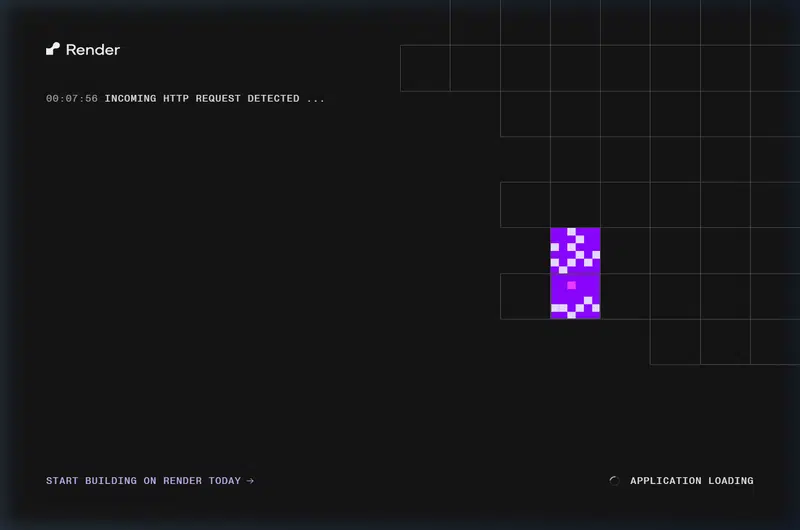
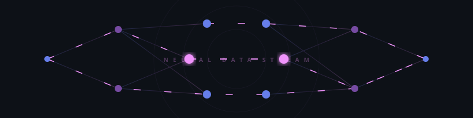

<!-- 
╔══════════════════════════════════════════════════════════════════════════════╗
║                                                                              ║
║   ██╗   ██╗ █████╗ ███████╗██╗  ██╗███████╗███╗   ██╗██████╗ ██████╗  █████╗  ║
║   ╚██╗ ██╔╝██╔══██╗██╔════╝██║  ██║██╔════╝████╗  ██║██╔══██╗██╔══██╗██╔══██╗ ║
║    ╚████╔╝ ███████║███████╗███████║█████╗  ██╔██╗ ██║██║  ██║██████╔╝███████║ ║
║     ╚██╔╝  ██╔══██║╚════██║██╔══██║██╔══╝  ██║╚██╗██║██║  ██║██╔══██╗██╔══██║ ║
║      ██║   ██║  ██║███████║██║  ██║███████╗██║ ╚████║██████╔╝██║  ██║██║  ██║ ║
║      ╚═╝   ╚═╝  ╚═╝╚══════╝╚═╝  ╚═╝╚══════╝╚═╝  ╚═══╝╚═════╝ ╚═╝  ╚═╝╚═╝  ╚═╝ ║
║                                                                              ║
║           🚀 AI & DATA SCIENCE STUDENT • DJANGO & REACT DEVELOPER 🚀          ║
║                                                                              ║
╚══════════════════════════════════════════════════════════════════════════════╝
-->

<div align="center">
  
  <!-- ═══════════════════════════════════════════════════════════════════════════ -->
  <!-- 🎯 ANIMATED HEADER                                                          -->
  <!-- ═══════════════════════════════════════════════════════════════════════════ -->
  
  
  
  <br/>
  
  <!-- ═══════════════════════════════════════════════════════════════════════════ -->
  <!-- 📊 PROFILE BADGES                                                           -->
  <!-- ═══════════════════════════════════════════════════════════════════════════ -->
  
  <a href="https://github.com/Yashendra-org">
    
  </a>
  &nbsp;
  <a href="https://github.com/Yashendra-org?tab=repositories">
    
  </a>
  &nbsp;
  <a href="https://github.com/Yashendra-org?tab=followers">
    
  </a>
  
</div>

<!-- ═══════════════════════════════════════════════════════════════════════════ -->
<!-- 💻 LAPTOP PORTFOLIO ANIMATION                                               -->
<!-- ═══════════════════════════════════════════════════════════════════════════ -->

<div align="center">
  
</div>


<!-- ═══════════════════════════════════════════════════════════════════════════ -->
<!-- 👤 ABOUT ME SECTION                                                          -->
<!-- ═══════════════════════════════════════════════════════════════════════════ -->


<table>
<tr>
<td width="55%" valign="top">

### 🎯 What I Do

```yaml
name: Yashendra Kumar
located_in: India 🇮🇳
current_status: B.Tech Computer Science (AI & Data Science)

areas_of_expertise:
  - 🤖 AI & Data Science Specialization
  - 🐍 Python & Java Programming
  - 🌐 Full-Stack Web Development (Django/React)
  - 🧠 Machine Learning Algorithms
  - 📊 Data Analytics & Power BI
  
life_philosophy: "Learning by building, one commit at a time."
```

</td>
<td width="45%" valign="top">

### 🚀 Current Focus

- 🔬 **Diving deeper** into Machine Learning and Data Science tools
- 💻 **Building web applications** using Django and React
- 🏆 **Solving algorithmic puzzles** on LeetCode
- 📊 **Designing interactive dashboards** in Power BI
- 🌟 **Actively looking** for internships and entry-level AI/Data roles

<br/>

### 💡 Quick Facts

- 🧠 Analytical and problem-solving mindset
- 🌱 Continuous learner exploring cutting-edge AI technologies
- ⚙️ Love automating workflows with Python scripts
- 🤝 Open to collaborate on data-driven projects

</td>
</tr>
</table>

<br/>


<!-- ═══════════════════════════════════════════════════════════════════════════ -->
<!-- 📁 EXPERIENCE SECTION                                                        -->
<!-- ═══════════════════════════════════════════════════════════════════════════ -->

<h3>💼 Experience</h3>

<details open>
<summary><b>▶ Intern &mdash; Hackwalt</b></summary>

**Role:** Intern  
**Core Stack:** Python · Machine Learning · SQL

- Contributed to data gathering, processing, and visualization tasks.
- Worked on optimizing dataset pipelines for ML models.
- Collaborated with engineering teams to deploy basic functional utilities.

</details>


<!-- ═══════════════════════════════════════════════════════════════════════════ -->
<!-- 🚀 PROJECTS SHOWCASE                                                        -->
<!-- ═══════════════════════════════════════════════════════════════════════════ -->

<details>
<summary><b>📂 Click to Expand: Featured Projects Showcase</b></summary>
<br/>

<div align="center">
  <a href="https://github.com/Yashendra-org/portfolio">
    
  </a>
  
  <br/><br/>
  
  <!-- Interactive Portfolio Walkthrough Animation -->
  
</div>

<br/>

| 🌟 Project | 💡 Description | 🛠 Stack |
|:--|:--|:--|
| [🌐 Personal Portfolio](https://github.com/Yashendra-org/Portfolio) | Personal developer portfolio website showcasing skills, projects, and contact details | HTML · CSS · JavaScript |
| [🤖 Profile Dashboard](https://github.com/Yashendra-org/Yashendra-org) | Custom profile dashboard repository showcasing engineering stats | Markdown · GitHub Actions |

</details>


<div align="center">
  
</div>

<br/>

<!-- ═══════════════════════════════════════════════════════════════════════════ -->
<!-- 📊 GITHUB ANALYTICS                                                         -->
<!-- ═══════════════════════════════════════════════════════════════════════════ -->


<div align="center">
  
  <!-- GitHub Stats + Custom Streak in ONE ROW -->
  <a href="https://github.com/Yashendra-org">
    
  </a>
  &nbsp;
  <a href="https://github.com/Yashendra-org">
    
  </a>
  
  <br/><br/>
  
  <!-- 📊 REAL-TIME LANGUAGE USAGE WITH PROGRESS BARS -->
  <a href="https://github.com/Yashendra-org">
    
  </a>
  
  <br/><br/>
  
  <!-- Snake Contribution Animation -->
  <picture>
    <source media="(prefers-color-scheme: dark)" srcset="https://raw.githubusercontent.com/Yashendra-org/Yashendra-org/output/github-snake-dark.svg"/>
    <source media="(prefers-color-scheme: light)" srcset="https://raw.githubusercontent.com/Yashendra-org/Yashendra-org/output/github-snake.svg"/>
    
  </picture>
  
  <br/><br/>
  
  <!-- Additional Stats Cards -->
  
  
</div>

<br/>


<br/>

<!-- ═══════════════════════════════════════════════════════════════════════════ -->
<!-- 🎮 CONTRIBUTION SHOWCASE                                                    -->
<!-- ═══════════════════════════════════════════════════════════════════════════ -->


<div align="center">
  
  <!-- Pac-Man Contribution Graph -->
  <picture>
    <source media="(prefers-color-scheme: dark)" srcset="https://raw.githubusercontent.com/Yashendra-org/Yashendra-org/output/pacman-contribution-graph-dark.svg"/>
    <source media="(prefers-color-scheme: light)" srcset="https://raw.githubusercontent.com/Yashendra-org/Yashendra-org/output/pacman-contribution-graph.svg"/>
    
  </picture>
  
  <br/>
  
  <sub>👾 Watch Pac-Man devour my contributions!</sub>
  
</div>

<div align="center">
  
</div>

<!-- ═══════════════════════════════════════════════════════════════════════════ -->
<!-- ⚡ TECH STACK                                                               -->
<!-- ═══════════════════════════════════════════════════════════════════════════ -->


<div align="center">

<!-- 💻 LANGUAGES & DATA -->
<h4>💻 Languages & Databases</h4>
<p>
  <a href="https://www.python.org/" target="_blank"></a>
  <a href="https://www.oracle.com/java/" target="_blank"></a>
  <a href="https://en.wikipedia.org/wiki/C_(programming_language)" target="_blank"></a>
  <a href="https://www.mysql.com/" target="_blank"></a>
</p>

<!-- 🌐 WEB DEVELOPMENT -->
<h4>🌐 Web Development</h4>
<p>
  <a href="https://reactjs.org/" target="_blank"></a>
  <a href="https://www.djangoproject.com/" target="_blank"></a>
  <a href="https://developer.mozilla.org/en-US/docs/Web/HTML" target="_blank"></a>
  <a href="https://developer.mozilla.org/en-US/docs/Web/CSS" target="_blank"></a>
  <a href="https://developer.mozilla.org/en-US/docs/Web/JavaScript" target="_blank"></a>
</p>

<!-- 📊 AI & DATA ANALYTICS -->
<h4>📊 AI &amp; Data Analytics</h4>
<p>
  
  &nbsp;
  
  &nbsp;
  
  &nbsp;
  
</p>

<!-- 🔧 TOOLS & PLATFORMS -->
<h4>🔧 Tools &amp; Ecosystem</h4>
<p>
  <a href="https://git-scm.com/" target="_blank"></a>
  <a href="https://github.com/" target="_blank"></a>
  <a href="https://code.visualstudio.com/" target="_blank"></a>
</p>

</div>

<br/>


<br/>

<!-- ═══════════════════════════════════════════════════════════════════════════ -->
<!-- 🌐 CONNECT WITH ME                                                          -->
<!-- ═══════════════════════════════════════════════════════════════════════════ -->


<div align="center">
  
<a href="https://github.com/Yashendra-org" target="_blank">
  
</a>
&nbsp;
<a href="https://www.linkedin.com/in/yashendra-kumar2007/" target="_blank">
  
</a>
&nbsp;
<a href="https://leetcode.com/u/Yashendra_kumar/" target="_blank">
  
</a>
&nbsp;
<a href="mailto:yashendrakumar789@gmail.com">
  
</a>

</div>

<br/>


<br/>

<!-- ═══════════════════════════════════════════════════════════════════════════ -->
<!-- 💭 RANDOM DEV QUOTE                                                         -->
<!-- ═══════════════════════════════════════════════════════════════════════════ -->

<div align="center">
  
  ### 💭 Random Dev Quote
  
  <br/>
  
  <a href="https://github.com/Yashendra-org">
    
  </a>
  
</div>

<br/>

<!-- ═══════════════════════════════════════════════════════════════════════════ -->
<!-- 🌟 FOOTER                                                                   -->
<!-- ═══════════════════════════════════════════════════════════════════════════ -->

<div align="center">
  
  
  
  
  
</div>

<!-- ═══════════════════════════════════════════════════════════════════════════ -->
<!-- 📝 END OF README                                                            -->
<!-- ═══════════════════════════════════════════════════════════════════════════ -->
